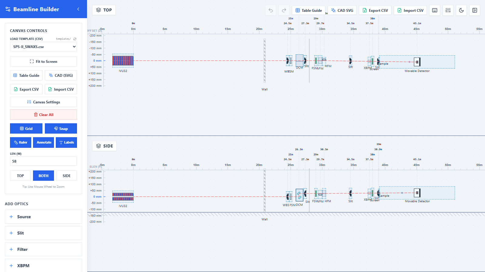

# Beamline Layout Builder

An interactive web app for designing synchrotron beamline layouts, with live ray tracing in the side (elevation) and top (plan) views, and construction schedules you can export to Excel and CAD.

**▶ Try it online: [rachapp.github.io/beamline_layout_builder](https://rachapp.github.io/beamline_layout_builder/)**



## Features

**Layout and ray tracing**
- TOP and SIDE views with the beam traced live through every component.
- Optics: undulator / wiggler / bending-magnet sources, slits, filters, XBPMs, gratings, vertical and horizontal DCMs, focusing mirrors (VFM / HFM), beam splitters with a diffracted branch, samples, screens and detectors.
- Construction: walls, hutches and floating chambers.
- Side and top anchors steer the beam: mirrors upstream of an anchor bend the beam to hit it, and the grazing and deflection angles (mrad) are calculated for you.
- Optional chamber / footprint box around each optic, with lock-length, lock-centre and asymmetric options.

**Editing**
- Place components from the sidebar; drag them, or nudge them with the arrow keys (0.1 m, or 1 m with Shift).
- Select several at once with Shift / Ctrl + click or Ctrl + A, then move or delete them together.
- Undo and redo every change (Ctrl + Z / Ctrl + Y), including Clear All.
- Your layout is saved in the browser automatically and restored when you come back.
- Lock a component in the Properties panel so it can't be moved by accident.
- Press **?** for the full list of keyboard shortcuts.

**Construction schedule and export**
- **Table Guide:** every component's position, length, upstream/downstream faces and clearance to the next component, with overlaps highlighted. All values are editable in the table.
- **Export / Import CSV:** a construction schedule that opens in Excel and loads back into the app unchanged.
- **CAD SVG:** a scaled vector drawing with dimensions, clearances and a title block.
- Ready-made SPS-II beamline templates in the template menu.

## Using the app

| To… | Do this |
| --- | --- |
| Load a template | Pick one from **Load Template (CSV)** in the sidebar |
| Add a component | Click it under **Add Optics** / **Add Construction**, then click on the TOP or SIDE view |
| Zoom to a component | Click it |
| Edit a component | Select it and use the **Properties** panel on the right |
| Rename | Double-click its label |
| Move the view | Drag the background to pan, scroll to zoom, press **F** to fit everything |
| Start over | **Clear All** (you can undo it) |

## Running it locally

Requires [Node.js](https://nodejs.org/) 22.22+ or 24.15+ (the tests use jsdom, which needs it); CI uses Node 24.

```bash
git clone https://github.com/rachapp/beamline_layout_builder.git
cd beamline_layout_builder
npm install
npm run dev
```

Then open the address Vite prints (usually http://localhost:5173).

### Templates

CSV templates live in [`templates/`](templates/). Add, edit or remove files there and the template menu updates while `npm run dev` is running; the production build copies them into the published site.

### Checks

```bash
npm run lint    # ESLint (an undefined variable fails the check)
npm test        # Vitest unit tests
npm run check   # both
npm run build   # production build in dist/
```

## Deployment

Pushing to `main` runs lint, tests and the build in GitHub Actions, then publishes the site to GitHub Pages. Nothing is published if a check fails. Pull requests run the same checks.

## Tech stack

React 18 · Vite · Tailwind CSS · Lucide icons · Vitest · ESLint

For how the code is organised (state hooks, ray tracing, CSV, components), see [ARCHITECTURE.md](ARCHITECTURE.md).

---

Developed by **rachapp** (Pornthep Pongchalee). © 2026 Beamline Builder Project.
